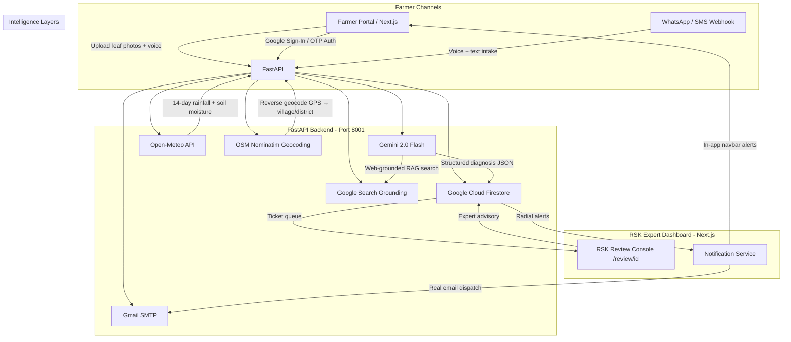

# Farm Fit — National Agricultural Intelligence Platform

Farm Fit is a full-stack, AI-powered agricultural intelligence platform built for India's Rythu Seva Kendra (RSK) network. It connects small and marginal farmers with expert agronomists through multimodal crop disease diagnosis, real-time outbreak tracking, intelligent search, and automated multilingual notifications.

---

## 🌟 Architecture Overview



- **Backend**: FastAPI (Python), Uvicorn, Pydantic v2 settings
- **Database**: Google Cloud Firestore (Native Mode, `asia-south1`)
- **Frontend**: Next.js 16 (React), Vanilla CSS + Tailwind, Lucide Icons
- **Auth**: Google Sign-In (`Continue with Google`) + Phone OTP verification
- **AI Models**: Gemini 2.0 Flash — multimodal diagnosis, intent parsing, web grounding, embedding
- **Notifications**: Gmail SMTP (HTML email) + in-app Firestore alert feed
- **Geocoding**: OSM Nominatim reverse geocoding (GPS → village/district)
- **Weather**: Open-Meteo (cumulative rainfall, soil moisture, dry-spell detection)
- **Speech**: Google Cloud Speech-to-Text + Cloud Translation API

---

## 🚀 Features

### 🔐 Authentication
- **Google Sign-In** (`Continue with Google`) for both farmers and RSK professionals
- Phone number OTP verification at sign-up (Google OTP via Gmail SMTP)
- JWT-based session tokens; role-aware routing (`FARMER` / `PROFESSIONAL` / `ADMIN`)
- Account lookup from `farmers` and `professionals` Firestore collections using Google email as document ID

### 🌿 Crop Disease Diagnosis
- Upload up to **3 leaf/stalk photographs** simultaneously; rendered in a preview gallery
- Farmer name auto-filled from authenticated session
- `POST /api/v1/diagnosis/diagnose` — multimodal Gemini 2.0 Flash diagnosis with structured JSON output
- Confidence scores, disease name, severity level, treatment advisory, and recommended next steps written to Firestore ticket
- AI disclaimer banner shown to farmer: *"This diagnosis is made by an AI — please wait for RSK expert follow-up"*

### 🧑‍🌾 RSK Expert Dashboard
- **Ticket Queue** with filter tabs: All · Pending · In-Progress · On-Hold · High Severity · Resolved
- **Dynamic Review Console** (`/review/[id]`) — opening a ticket auto-assigns it to the logged-in expert and sets status to `IN_PROGRESS`
- Interactive **photo lightbox** — click any attached image for fullscreen view
- **Expert Advisory Submission** — rich text advisory dispatched to farmer via email + in-app notification
- **On-Site Hold Dispatch** — sends automated alert and logs hold reason
- Expert advisory emails translate the advisory text and send formatted HTML emails directly to the farmer's Gmail (no links, no mock emails)

### 📣 Outbreak Registration & Radial Alerting
- RSK experts register confirmed disease outbreaks via `POST /api/v1/outbreak/register`
- **GPS auto-fill**: browser geolocation pins the exact outbreak location
- **Village & district auto-fill**: reverse geocoded in real-time via OSM Nominatim (Kolkata returns Kolkata, not Nellore)
- **Affected farmer count** auto-calculated from tickets within the outbreak radius
- **Radial email alerting**: `notify_farmers_in_radius()` runs a Haversine distance scan across all tickets, resolves each farmer's real Gmail (from `farmers` collection or ticket email field), and sends individual HTML alert emails
- System-wide in-app navbar alert posted simultaneously for all users
- Duplicate emails de-duplicated; test/dummy accounts (`@farmfit.com`, `test@`, etc.) are skipped

### 🔔 Notification System
- **In-app alert feed** in the Navbar — shows unread count badge, populates from Firestore `alerts` collection
- **Notifications page** (`/notifications`) — filter Unread Only, Mark All Read, test email alert
- Alerts are user-targeted via Google email; system-wide alerts (no email target) visible to all
- **Gmail SMTP dispatch** — rich HTML email for every alert with severity colour coding
- Email only dispatched to real authenticated Gmail addresses; `@farmfit.com` fallback addresses are never emailed

### 🗺️ GIS Disease Map
- Leaflet.js interactive map (`/gis`) showing farmer ticket locations and confirmed outbreak clusters
- Map center dynamically computed as the **geographic centroid** of all actual data points
- Outbreak popups show real village/district names from the reverse-geocoded Nominatim data
- Farmer tickets with no GPS coordinates are excluded (no fake Nellore fallback pins)

### 🔍 RAG Search Engine (Dual-Layer)
- **Layer 1 — Live Web Grounding**: Gemini 2.0 Flash + `google_search` tool fetches real-time web results and synthesizes a grounded answer with source citations for any query (schemes, prices, policies, diseases, research)
- **Layer 2 — Local Knowledge Corpus**: 25 curated agricultural documents embedded with `text-embedding-004` and retrieved via cosine similarity — covers ICAR disease advisories, government schemes (PM-KISAN, PMFBY, Krishak Bandhu, KCC), soil science, MSP prices 2024-25, organic farming, e-NAM, drip irrigation, climate-smart agriculture
- Both layers run **concurrently** via `asyncio.gather()` — results merged into a single response
- Voice search in 9 Indian languages; queries auto-translated to English before search
- `POST /api/v1/knowledge/search` — returns `{ answer, web_sources, local_passages }`

### 📊 Farm Analytics & Satellite Monitoring
- **NDVI / Soil Moisture** timelines via Open-Meteo historical data
- **Mandi Price Comparison** — live APMC commodity prices from Agmarknet API (`data.gov.in`)
- **Analytics Logging** page — structured activity log with filters
- **District Summary Service** — aggregates ticket data by district for admin overview

### 🌾 Agronomy & Crop Recommendation
- Accepts soil N-P-K, pH, and GPS coordinates
- Gemini-powered crop suitability recommendation with weather overlay
- Background dry-spell detection loop (`weather_alert_service.py`)

### 🗣️ Voice & Multilingual Intake
- WhatsApp / SMS webhook intake (`/webhook`) — Speech-to-Text → Translation → Gemini intent parsing → Firestore ticket
- Supports Hindi, Telugu, Tamil, Kannada, Bengali, Marathi, Gujarati, Punjabi, English
- Voice input on Diagnose, RAG Search, and Intake pages via Web Speech API + Google Cloud STT

---

## 📁 Directory Structure

```text
Farm_Fit/
├── main.py                           # FastAPI app init, router registration, background scheduler
├── db.py                             # Firestore native client configuration
├── config.py                         # Pydantic BaseSettings — reads from .env
├── requirements.txt                  # Python dependencies
├── .env                              # Environment variables (never committed)
│
├── routes/
│   ├── auth.py                       # Google Sign-In, OTP signup, JWT token issue
│   ├── diagnosis.py                  # Multi-image upload → Gemini diagnosis → Firestore ticket
│   ├── expert.py                     # Expert dashboard queue, review, advisory submission
│   ├── outbreak.py                   # Outbreak registration + Nominatim reverse geocoding
│   ├── notifications.py              # Notification CRUD (fetch, mark read, test email)
│   ├── knowledge.py                  # RAG search — /query (local) + /search (dual-layer)
│   ├── agronomy.py                   # Soil NPK recommendation endpoint
│   ├── intake.py                     # WhatsApp/SMS voice intake webhook pipeline
│   ├── gis.py                        # GIS map layer API (farmer locations + outbreak clusters)
│   ├── history.py                    # Farmer diagnosis history retrieval
│   ├── market.py                     # Mandi/commodity price endpoint
│   ├── admin.py                      # Admin dashboard data endpoint
│   ├── alerts.py                     # Alert broadcast endpoint
│   ├── risk.py                       # Crop risk scoring
│   ├── yield.py / yield_route.py     # Yield estimation endpoints
│   ├── government.py                 # Government scheme lookup
│   └── webhook.py                    # Twilio WhatsApp/SMS webhook handler
│
├── services/
│   ├── knowledge_service.py          # Dual-layer RAG: Gemini grounding + 25-doc local corpus
│   ├── notification_service.py       # In-app alert creation + Haversine radial email dispatch
│   ├── email_service.py              # Gmail SMTP HTML email templates
│   ├── diagnosis_service.py          # Gemini 2.0 Flash multimodal diagnosis pipeline
│   ├── gis_service.py                # GIS layer builder — dynamic centroid, real GPS only
│   ├── outbreak_service.py           # Outbreak radius scan + affected farmer count
│   ├── translation_service.py        # Google Cloud Translation API wrapper
│   ├── speech_service.py             # Google Cloud Speech-to-Text wrapper
│   ├── intent_parser.py              # Gemini intent extraction from voice transcripts
│   ├── agronomy_service.py           # Crop suitability recommendation engine
│   ├── satellite_service.py          # Geocoding + Open-Meteo NDVI/soil-moisture engine
│   ├── weather_alert_service.py      # Background dry-spell detection loop
│   ├── analytics_service.py          # Analytics aggregation
│   ├── district_summary_service.py   # District-level ticket summary
│   ├── market_service.py             # Agmarknet commodity price fetcher
│   ├── risk_service.py               # Crop risk scoring logic
│   ├── scheme_service.py             # Government scheme lookup service
│   └── yield_service.py              # Yield estimation service
│
└── rsk-dashboard/                    # Next.js 16 Frontend
    └── src/app/
        ├── page.tsx                  # RSK Expert main dashboard (ticket queue + tabs)
        ├── login/page.tsx            # Login — Continue with Google + phone OTP
        ├── signup/page.tsx           # Signup — Google auth + phone OTP + role selection
        ├── diagnose/page.tsx         # Farmer crop diagnosis (multi-image upload + voice)
        ├── review/[id]/page.tsx      # Dynamic RSK Expert review console
        ├── knowledge/page.tsx        # Dual-layer RAG search engine UI
        ├── notifications/page.tsx    # Notification inbox (filter, mark read)
        ├── gis/page.tsx              # Leaflet GIS disease map
        ├── agronomy/page.tsx         # Soil NPK recommendation + weather
        ├── analytics/page.tsx        # Farm analytics + satellite monitoring
        ├── analytics/logging/page.tsx# Analytics activity log
        ├── admin/page.tsx            # Admin dashboard
        └── components/
            └── Navbar.tsx            # Global navbar — alert badge, user role, API status
```

---

## 🛠️ Installation & Setup

### 1. Configure `.env`

```env
# Google Gemini
GEMINI_API_KEY=your_gemini_api_key

# Google Cloud (Firestore + Speech + Translation)
GOOGLE_CLOUD_PROJECT=your_project_id
GOOGLE_APPLICATION_CREDENTIALS=C:\path\to\serviceaccountkey.json
MOCK_GCP_APIS=False

# Gmail SMTP (for OTP + notification emails)
SMTP_USERNAME=your_gmail_address@gmail.com
SMTP_PASSWORD=your_gmail_app_password

# Government APIs
DATA_GOV_IN_API_KEY=your_data_gov_in_key

# Server
ENVIRONMENT=development
PORT=8001
HOST=0.0.0.0
```

### 2. Run the FastAPI Backend

```bash
pip install -r requirements.txt
uvicorn main:app --reload --port 8001
```

API docs available at `http://localhost:8001/docs`

### 3. Run the Next.js Frontend

```bash
cd rsk-dashboard
npm install
npm run dev
```

Open `http://localhost:3000`

---

## 🔑 Key API Endpoints

| Method | Endpoint | Description |
|--------|----------|-------------|
| `POST` | `/api/v1/auth/google/login` | Google Sign-In authentication |
| `POST` | `/api/v1/auth/google/signup/complete` | Complete Google + OTP registration |
| `POST` | `/api/v1/diagnosis/diagnose` | Multi-image Gemini crop diagnosis |
| `GET`  | `/api/v1/expert/tickets` | Fetch RSK expert ticket queue |
| `POST` | `/api/v1/expert/tickets/{id}/resolve` | Submit expert advisory + email farmer |
| `POST` | `/api/v1/outbreak/register` | Register outbreak + radial email alerts |
| `GET`  | `/api/v1/notifications` | Fetch in-app alerts (filter by email) |
| `POST` | `/api/v1/knowledge/search` | Dual-layer RAG search (web + local corpus) |
| `GET`  | `/api/v1/gis/map-layers` | GIS farmer + outbreak GeoJSON layers |
| `POST` | `/api/v1/agronomy/recommend` | Soil NPK crop recommendation |
| `POST` | `/api/v1/intake/voice` | WhatsApp/SMS voice intake pipeline |

---

## 👥 Team

Built by the **Kisan Alert AI** team for the national RSK agricultural intelligence network.
