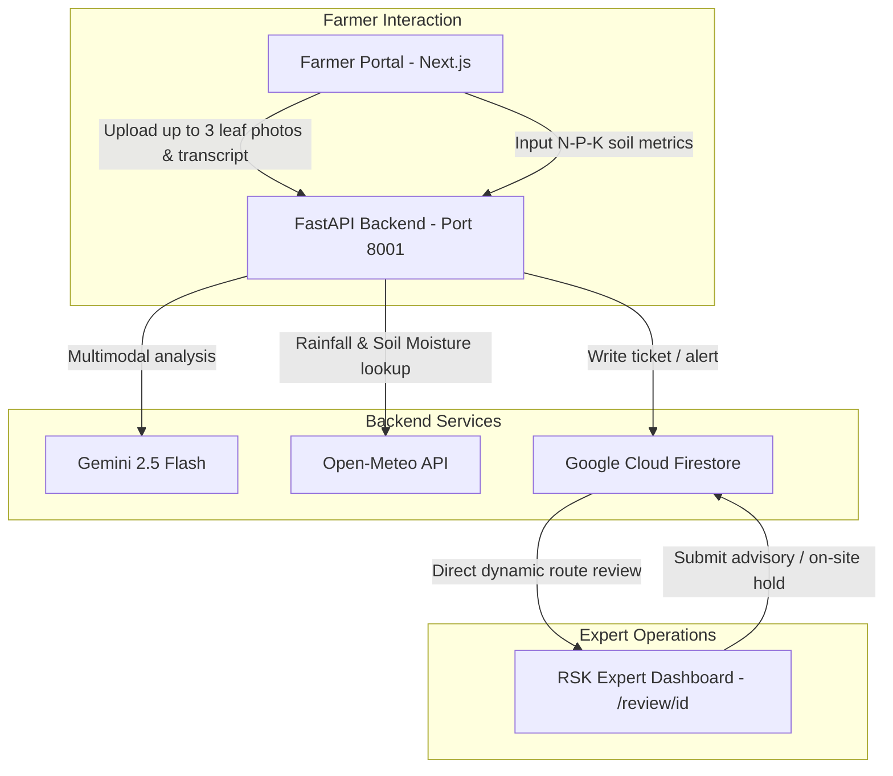

# Kisan Alert - AI-Driven Agronomic Ingestion & Expert Advisory System

Kisan Alert is a voice-and-SMS agricultural intelligence platform designed to empower small and marginal farmers. This repository houses the core multimodal crop disease diagnosis pipeline, soil crop recommendation engine, automated weather advisory loop, and real-time Rythu Seva Kendras (RSK) expert dashboard.

---

## 🌟 Tech Stack & Architecture



*   **Backend**: FastAPI (Python 3.14), Uvicorn.
*   **Database**: Google Cloud Firestore (Native Mode, hosted in India `asia-south1`).
*   **Frontend**: Next.js 15 (React 19), Tailwind CSS v4, Lucide Icons, and Firebase Web SDK.
*   **AI Models**: Gemini 2.5 Flash via Google GenAI SDK (Multimodal & Pydantic Structured JSON Outputs).
*   **Weather & Soil Engine**: Open-Meteo API (cumulative historical 14-day rainfall, daily soil moisture, and dry-spell checks).

---

## 🚀 Current Status & Features

### 🟢 Task 1: Computer Vision & Diagnosis Engine
*   **Multiple Image Ingestion**: Allows farmers to upload up to 3 leaf/stalk photographs simultaneously from different angles, rendering a preview gallery with file delete buttons.
*   **Auth Auto-fill**: Farmer name is automatically loaded and pre-filled from the logged-in session context.
*   **AI Diagnosis Route**: `POST /api/v1/diagnosis/diagnose` processes the photographs in a single multimodal array, runs Gemini 2.5 Flash, outputs structured JSON, and writes a detailed ticket to Firestore.
*   **Warning Disclaimer**: Displays a prominent warning notice in bold above the AI Diagnosis card to the farmer: *"This diagnosis is made by an AI and may not be correct, please wait for an RSK expert for a follow up"*.

### 🟢 Task 2: Agronomy Recommendation & Weather Analytics
*   **Soil Recommendation Portal**: Accepts soil Nitrogen (N), Phosphorus (P), Potassium (K), pH, and location coordinates.
*   **Mandi Price Comparison**: Integrates live APMC commodity price feeds from the Government of India's **Agmarknet API** (`data.gov.in`), allowing farmers to compare crop suggestions side-by-side with market price curves.
*   **Background Weather Poller**: `services/weather_alert_service.py` runs a background task scheduler checking regional coordinates for dry spells and logging warnings in Firestore.
*   **Dynamic NDVI Satellite Monitoring**: The **Farm Analytics** page queries the backend `SatelliteService` which geocodes village names using Gemini 2.5 Flash, fetches daily historical soil moisture from **Open-Meteo**, and calculates dynamic NDVI canopy index timelines for the past 5 months.

### 🟢 Task 3: Rythu Seva Kendras (RSK) Admin Dashboard
*   **RSK Review Routing**: The old cramped details sidebar has been migrated to dedicated dynamic pages (`/review/[id]`). 
*   **In-Progress Auto-Assignment**: Opening any pending ticket automatically updates its status to `IN_PROGRESS` and assigns it to the logged-in expert.
*   **Interactive Lightbox**: Submitted crop photographs are displayed as attachments; clicking them opens a fullscreen lightbox view without triggering a file download.
*   **On-Site visit hold**: Experts can click "Hold for On-Site" which opens a dispatch form, updates the ticket, and pushes an automated **Twilio SMS / WhatsApp message** and in-app alert to the farmer.
*   **Filtered Views**: Quick search tabs let experts filter active tickets by: *All, Pending, In Progress (assigned to you), On Hold (assigned to you), and High Severity*. Resolved tickets are archived.

---

## 📁 Directory Structure

```text
Farm_Fit/
├── main.py                          # FastAPI server initialization & background scheduler
├── db.py                            # Firestore native client configuration
├── config.py                        # Pydantic BaseSettings environment variable loader
├── requirements.txt                 # Backend python dependencies
├── .env                             # Environment configuration (MOCK_GCP_APIS=False, API keys)
├── routes/
│   ├── expert.py                    # Expert dashboard resolution & individual retrieval endpoints
│   ├── diagnosis.py                 # Multi-image Ingestion & Gemini diagnostic endpoint
│   └── agronomy.py                  # Soil N-P-K recommendation endpoint
├── services/
│   ├── diagnosis_service.py         # Gemini 2.5 Flash multimodal diagnosis pipeline
│   ├── agronomy_service.py          # Gemini 2.5 Flash crop suitability recommendation engine
│   ├── satellite_service.py         # Gemini geocoding + Open-Meteo NDVI satellite engine
│   └── weather_alert_service.py     # Background loop checking Open-Meteo dry spells
└── rsk-dashboard/                   # Next.js React Dashboard
    ├── src/
    │   ├── app/
    │   │   ├── page.tsx             # Interactive dashboard (Tabs, Form, and Queue render)
    │   │   ├── review/[id]/page.tsx # Dynamic routed RSK Expert review console
    │   │   └── layout.tsx           # Global HTML document shell
    └── package.json                 # Node package configuration
```

---

## 🛠️ Installation & Setup

### 1. Configure production keys in `.env`
Enable production mode by setting `MOCK_GCP_APIS=False` in the root `.env` file:
```env
GEMINI_API_KEY=your_gemini_api_key
GOOGLE_CLOUD_PROJECT=farm-fit-501004
MOCK_GCP_APIS=False
GOOGLE_APPLICATION_CREDENTIALS=c:\path\to\serviceaccountkey.txt
SMTP_USERNAME=your_gmail_otp_address
SMTP_PASSWORD=your_gmail_app_password
DATA_GOV_IN_API_KEY=your_government_api_key
```

### 2. Run the FastAPI Backend
```bash
# Install dependencies
pip install -r requirements.txt

# Run the server on port 8001
uvicorn main:app --reload --port 8001
```

### 3. Run the Next.js Frontend
```bash
cd rsk-dashboard
npm install
npm run dev
```
Open `http://localhost:3000` to access the portal.
