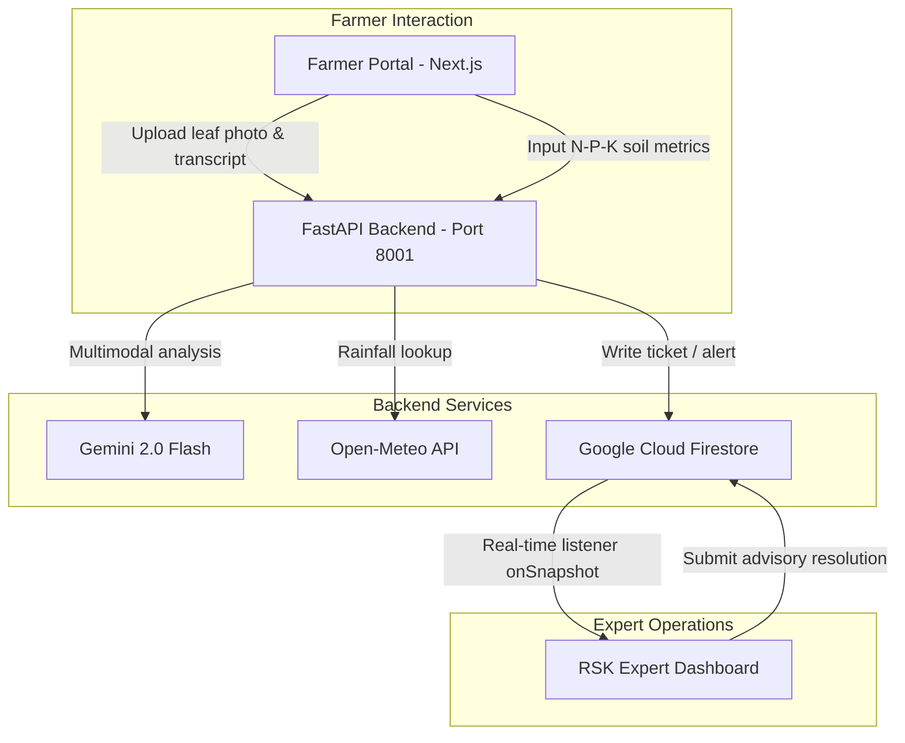

# Kisan Alert - AI-Driven Agronomic Ingestion & Expert Advisory System

Kisan Alert is a voice-and-SMS agricultural intelligence platform designed to empower small and marginal farmers. This repository houses the core multimodal crop disease diagnosis pipeline, soil crop recommendation engine, automated weather advisory loop, and real-time Rythu Seva Kendras (RSK) expert dashboard.

---

## 🌟 Tech Stack & Architecture



*   **Backend**: FastAPI (Python 3.14), Uvicorn.
*   **Database**: Google Cloud Firestore (Native Mode, hosted in India `asia-south1`).
*   **Frontend**: Next.js 15 (React 19), Tailwind CSS v4, Lucide Icons, and Firebase Web SDK.
*   **AI Models**: Gemini 2.0 Flash via Google GenAI SDK (Multimodal & Pydantic Structured JSON Outputs).
*   **Weather Engine**: Open-Meteo API (cumulative historical 14-day rainfall and dry-spell checks).

---

## 🚀 Current Status & Features

### 🟢 Task 1: Computer Vision & Diagnosis Engine
*   **Farmer Advisory Portal**: Allows farmers to upload an image of a crop leaf/stalk and input a problem description transcript.
*   **AI Diagnosis Route**: `POST /api/v1/diagnosis/diagnose` processes the request, invokes Gemini 2.0 Flash, outputs structured JSON, and automatically inserts the ticket into Firestore.
*   **Rate-Limit Resilience**: Includes a local rule-based fallback keyword parser. If your Gemini API free-tier key hits a `429 RESOURCE_EXHAUSTED` limit, the backend automatically intercepts it and generates a logical advisory based on transcript keywords to maintain testing continuity.
*   **Confidence Display**: Next.js dashboard renders the confidence score of the diagnosis (e.g., `94%`).

### 🟢 Task 2: Agronomy Recommendation & Weather Analytics
*   **Soil Recommendation Portal**: Accepts soil Nitrogen (N), Phosphorus (P), Potassium (K), pH, and location coordinates.
*   **Weather Ingestion**: API automatically queries Open-Meteo for the coordinates to compute the cumulative rainfall (mm) over the past 14 days.
*   **Crop recommendations Route**: `POST /api/v1/agronomy/recommend` evaluates N-P-K ratios and rainfall to recommend the top 3 optimal crops (with N-P-K fallback rules for API rate-limit coverage).
*   **Background Weather Poller**: `services/weather_alert_service.py` runs a background task scheduler checks regional centers for dry spells (0mm rain + average temperatures $\ge 38^\circ\text{C}$ over 14 days) and posts warning updates in Firestore.

### 🟢 Task 3: Rythu Seva Kendras (RSK) Admin Dashboard
*   **Real-time Synced Queue**: Listens to the Firestore `tickets` collection using `onSnapshot` listeners. As soon as a farmer submits a diagnosis, it immediately pops up in the expert worklist without requiring a page refresh.
*   **Filtered Views**: Split views for *All Alerts*, *Pending Review*, *High Severity*, and *Resolved*.
*   **Expert Resolution Drawer**: Experts can click on any ticket, review the voice transcript, examine the image, write advisory notes, change status, and send the resolution.

---

## 📁 Directory Structure

```text
Farm_Fit/
├── main.py                          # FastAPI server initialization & background scheduler
├── db.py                            # Firestore native client singleton configuration
├── config.py                        # Pydantic BaseSettings environment variable loader
├── requirements.txt                 # Backend python dependencies
├── .env                             # Environment configuration (credentials & API key)
├── serviceaccountkey.txt            # GCP Firestore service account JSON
├── routes/
│   ├── expert.py                    # Expert dashboard resolution endpoints
│   ├── diagnosis.py                 # Ingestion & Gemini diagnostic endpoint
│   └── agronomy.py                  # Soil N-P-K recommendation endpoint
├── services/
│   ├── diagnosis_service.py         # Gemini multimodal diagnosis pipeline with fallback
│   ├── agronomy_service.py          # Gemini crop suitability recommendation engine
│   └── weather_alert_service.py     # Background loop checking Open-Meteo dry spells
├── scratch/
│   ├── test_services.py             # Service testing script
│   ├── test_diagnosis_route.py      # Diagnosis route validation tester
│   └── test_agronomy_route.py       # Agronomy route validation tester
└── rsk-dashboard/                   # Next.js React Dashboard
    ├── src/
    │   ├── app/
    │   │   ├── page.tsx             # Interactive dashboard (Tabs, Form, and Queue render)
    │   │   └── layout.tsx           # Global HTML document shell
    │   └── lib/
    │       └── firebase.ts          # Client-side Firestore config listener
    ├── .env.local                   # Configured NEXT_PUBLIC_API_URL pointing to port 8001
    └── package.json                 # Node package configuration
```

---

## 🛠️ Installation & Setup

### 1. Firestore Setup on GCP
1. Go to the [Google Cloud Console](https://console.cloud.google.com/).
2. Create/select project `farm-fit-501004`.
3. Create a **Firestore database** in **Native Mode**.
4. Set Location type to **Region** and select **`asia-south1` (Mumbai)** or **`asia-south2` (Delhi)**.
5. Setup database security rules to **Open** for local development.
6. Generate a service account key and save it as `serviceaccountkey.txt` in the root of the backend folder.

### 2. Run the FastAPI Backend
Initialize your virtual environment, install dependencies, and start the server:
```bash
# Install dependencies
pip install -r requirements.txt

# Run the server on port 8001
uvicorn main:app --reload --port 8001
```

### 3. Run the Next.js Frontend
Configure the API port inside `rsk-dashboard/.env.local` to point to the backend:
```env
NEXT_PUBLIC_API_URL=http://localhost:8001
```
Install node modules and start the development server:
```bash
cd rsk-dashboard
npm install
npm run dev
```
Open `http://localhost:3000` to access the dashboard.

---

## 🧪 Route Testing
You can run these scripts to verify API endpoint integrity:
*   **Diagnose Endpoint**: `python scratch/test_diagnosis_route.py`
*   **Soil Recommendation Endpoint**: `python scratch/test_agronomy_route.py`
